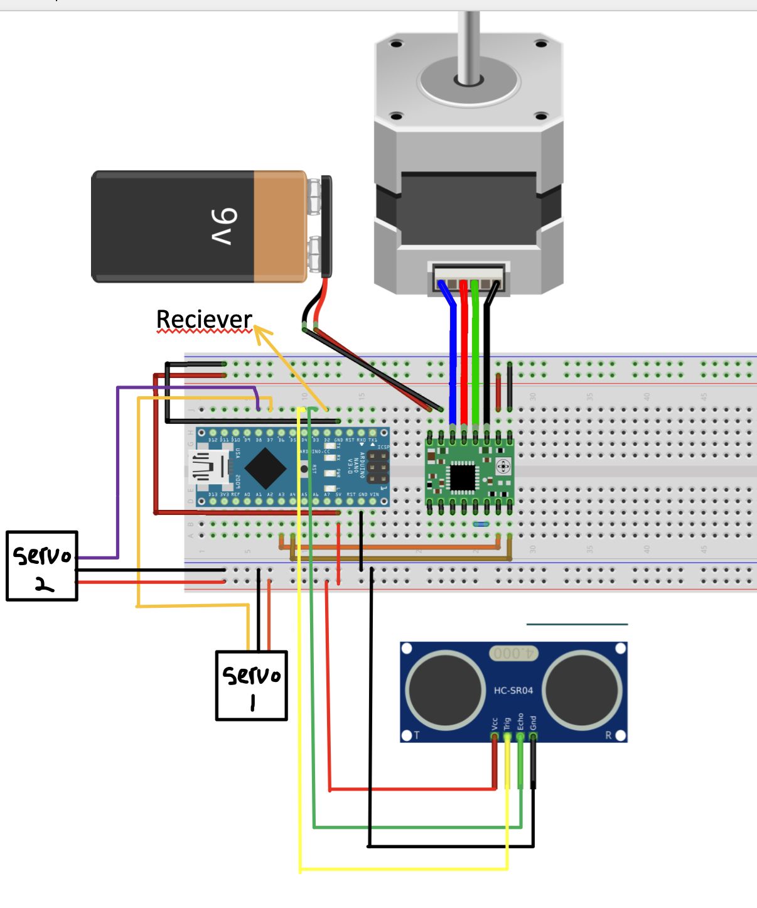

# Deployment Script

## Ports
- D2: Ultrasonic Sensor (Red)
- D3: Ultrasonic Sensor (Yellow)
- D7: Servo 1
- D8: Servo 2

- A2: Radio (Channel 3)
- A3: Stepper Driver (Orange)
- A4: Stepper Driver (Brown)

## Wiring

